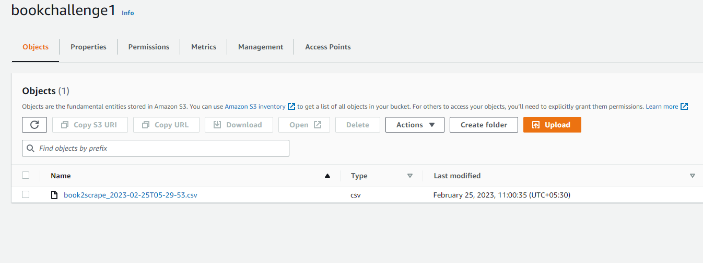

# Zyte Coding Assignment - Challenge 1
**Summary:**

This spider will scrape from https://books.toscrape.com website and exports the output to S3 bucket using AWS API Access Token for the below fields:

**Book Title**  |  **Product Price**  |  **Image URL**  |  **Book URL**


**Note:** This spider will only scrape only the first 750 items in the website. 

**Requirements**: This project requires [botocore](https://pypi.org/project/botocore) module to be installed for exporting the output to AWS S3 Bucket.

```
pip install botocore
```

**In order to clone this project use the below command:**

```
git clone https://github.com/ursnagh/Challenge1.git
```

If you like to have an experience of creating your own scrapy spider, by executing the steps below in your Terminal: 

**Create a New Scrapy Spider Project**

```
scrapy startproject books
cd books
scrapy genspider book2scrape books.toscrape.com
```

You can overwrite your exisitng *settings.py* and the *./spiders/books.py* file from this repository.

**To save the data into a JSON file, please execute the below command:**

```
scrapy crawl book2scrape -o output.json
```

**To ensure that the spider stops scraping at 750 items I have modified the pipeline in the pipelines.py file as given below**

```
from itemadapter import ItemAdapter
from scrapy.exceptions import DropItem
from scrapy.utils.project import get_project_settings

class Challenge1Pipeline:
    settings = get_project_settings()
    item_count = 0
    def process_item(self, item, spider):
        if self.item_count >= self.settings['ITEMCOUNT'] and self.settings['ITEMCOUNT'] != 0:
            raise DropItem(
                "ITEMCOUNT limit has been reached - " + str(self.settings['ITEMCOUNT']))
        else:
            self.item_count += 1
            pass
        return item
```

**The value at which the spider has to stop scraping (in my case at 750) can be acheieved by modifying the below line in the *settings.py* file.**

```
ITEMCOUNT = 750
```

To export the output to AWS S3 bucket in csv format, you can modify the below information in the *settings.py* file with your own details for 

*AWS_ACCESS_KEY_ID* 

*AWS_SECRET_ACCESS_KEY*

*BUCKET*

```
AWS_ACCESS_KEY_ID = "Your_AWS_Access_Key"
AWS_SECRET_ACCESS_KEY = "Your_AWS_Secret_Access_Key"
BUCKET = "bookchallenge1"
FEEDS = {
    (
        "s3://bookchallenge1/%(name)s_%(time)s.csv"
    ): {
        "format": "csv",
        "encoding": "utf8",
    }
}
```
**Sample Output**

